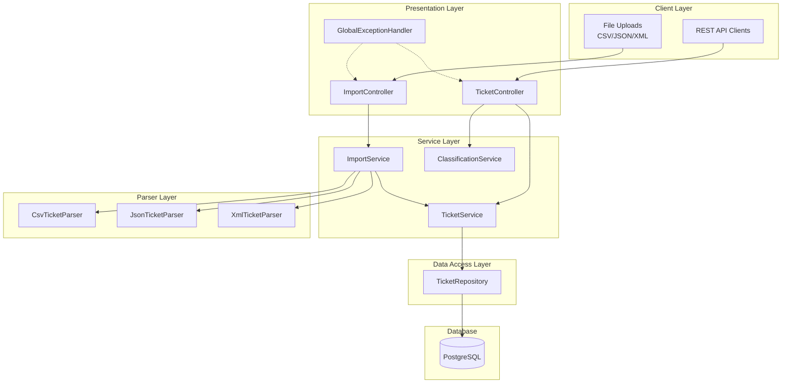

> **Student Name**: Yurii Smalko
> **Date Submitted**: Thu 5 Feb 2026
> **AI Tools Used**: Claude Code

# Intelligent Customer Support System

A customer support ticket management system built with Java/Spring Boot that imports tickets from multiple file formats, automatically categorizes issues, and assigns priorities.

## Features

- **Multi-Format Import**: Import tickets from CSV, JSON, and XML files
- **Auto-Classification**: Automatic ticket categorization and priority assignment based on keyword analysis
- **RESTful API**: Complete CRUD operations for ticket management
- **Filtering**: Query tickets by category, priority, status, and customer ID
- **Validation**: Comprehensive input validation with detailed error messages
- **Documentation**: OpenAPI/Swagger documentation included

## Architecture



## Tech Stack

| Component | Technology | Version |
|-----------|------------|---------|
| Language | Java | 17+ |
| Framework | Spring Boot | 3.2.x |
| Database | PostgreSQL | 15+ |
| Build Tool | Maven | 3.8+ |
| Testing | JUnit 5 + Mockito | Latest |
| Coverage | JaCoCo | 0.8.11 |
| CSV Parsing | OpenCSV | 5.9 |
| API Docs | SpringDoc OpenAPI | 2.3.0 |

## Prerequisites

- Java 17 or higher
- Maven 3.8 or higher
- Docker and Docker Compose
- PostgreSQL 15+ (or use Docker)

## Quick Start

### Option 1: Using Scripts (Recommended)

```bash
cd homework-2/src

# Make scripts executable
chmod +x scripts/*.sh

# Start everything (PostgreSQL + Application)
./scripts/start.sh
```

### Option 2: Manual Setup

#### 1. Clone and Navigate

```bash
cd homework-2/src
```

#### 2. Copy Environment Configuration

```bash
cp .env.example .env
# Edit .env if you need custom settings
```

#### 3. Start Database

```bash
docker-compose up -d postgres

# Wait for PostgreSQL to be ready
docker-compose exec postgres pg_isready -U postgres -d tickets
```

#### 4. Run Application

```bash
./mvnw spring-boot:run -Dspring-boot.run.profiles=local
```

### Access Points

- **API Base URL**: http://localhost:8080
- **Swagger UI**: http://localhost:8080/swagger-ui.html
- **API Docs**: http://localhost:8080/api-docs
- **PgAdmin** (optional): http://localhost:5050 (start with `docker-compose --profile tools up -d`)

### Utility Scripts

| Script | Description |
|--------|-------------|
| `scripts/start.sh` | Start PostgreSQL and application |
| `scripts/stop.sh` | Stop all services |
| `scripts/reset-db.sh` | Reset database (drops all data) |
| `scripts/verify.sh` | Run deployment verification tests |

### Verify Installation

After starting the application, verify it's working:

```bash
# Health check
curl http://localhost:8080/actuator/health

# Create a test ticket
curl -X POST http://localhost:8080/tickets \
  -H "Content-Type: application/json" \
  -d '{
    "customerEmail": "test@example.com",
    "customerName": "Test User",
    "subject": "Test Ticket",
    "description": "Testing the installation."
  }'

# List tickets
curl http://localhost:8080/tickets
```

## Project Structure

```
src/
├── main/
│   ├── java/com/support/ticketsystem/
│   │   ├── TicketSystemApplication.java    # Main application
│   │   ├── config/                         # Configuration classes
│   │   │   ├── OpenApiConfig.java
│   │   │   └── ClassificationConfig.java
│   │   ├── controller/                     # REST controllers
│   │   │   ├── TicketController.java
│   │   │   └── ImportController.java
│   │   ├── service/                        # Business logic
│   │   │   ├── TicketService.java
│   │   │   ├── ImportService.java
│   │   │   └── ClassificationService.java
│   │   ├── repository/                     # Data access
│   │   │   ├── TicketRepository.java
│   │   │   └── TicketSpecification.java
│   │   ├── domain/                         # Domain objects
│   │   │   ├── entity/Ticket.java
│   │   │   ├── dto/                        # Request/Response DTOs
│   │   │   └── enums/                      # Enum types
│   │   ├── parser/                         # File parsers
│   │   │   ├── TicketFileParser.java
│   │   │   ├── CsvTicketParser.java
│   │   │   ├── JsonTicketParser.java
│   │   │   └── XmlTicketParser.java
│   │   ├── mapper/                         # Entity-DTO mappers
│   │   │   └── TicketMapper.java
│   │   └── exception/                      # Exception handling
│   │       ├── GlobalExceptionHandler.java
│   │       ├── TicketNotFoundException.java
│   │       ├── ImportParseException.java
│   │       └── UnsupportedFileFormatException.java
│   └── resources/
│       ├── application.yml                 # Main configuration
│       ├── application-local.yml           # Local profile
│       └── db/migration/                   # Flyway migrations
│           └── V1__create_tickets_table.sql
└── test/
    ├── java/com/support/ticketsystem/      # Test classes
    │   ├── controller/
    │   ├── service/
    │   ├── parser/
    │   ├── integration/
    │   └── performance/
    └── resources/
        ├── application-test.yml            # Test configuration
        └── fixtures/                       # Test data files
```

## Running Tests

### Run All Tests

```bash
./mvnw test
```

### Run with Coverage Report

```bash
./mvnw test jacoco:report
```

Coverage report will be available at: `target/site/jacoco/index.html`

### Run Specific Test Class

```bash
./mvnw test -Dtest=TicketControllerTest
```

## API Endpoints

| Method | Endpoint | Description |
|--------|----------|-------------|
| POST | `/tickets` | Create a new ticket |
| GET | `/tickets` | List all tickets (with filtering) |
| GET | `/tickets/{id}` | Get ticket by ID |
| PUT | `/tickets/{id}` | Update ticket |
| DELETE | `/tickets/{id}` | Delete ticket |
| POST | `/tickets/import` | Bulk import from file |
| POST | `/tickets/{id}/auto-classify` | Auto-classify ticket |

See [API_REFERENCE.md](API_REFERENCE.md) for detailed documentation.

## Configuration

### Environment Variables

| Variable | Description | Default |
|----------|-------------|---------|
| `DB_HOST` | Database host | localhost |
| `DB_PORT` | Database port | 5432 |
| `DB_NAME` | Database name | tickets |
| `DB_USERNAME` | Database username | postgres |
| `DB_PASSWORD` | Database password | postgres |
| `SERVER_PORT` | Application port | 8080 |

### Using .env File

Copy `.env.example` to `.env` and modify as needed:

```bash
cp .env.example .env
```

## Sample Data

### Production Sample Data

Large sample datasets for testing bulk import in `data/`:

| File | Records | Description |
|------|---------|-------------|
| `sample_tickets.csv` | 50 | CSV format with all categories and priorities |
| `sample_tickets.json` | 20 | JSON array with nested metadata |
| `sample_tickets.xml` | 30 | XML format with nested tags elements |

Import sample data:

```bash
# Import CSV
curl -X POST http://localhost:8080/tickets/import \
  -F "file=@data/sample_tickets.csv"

# Import JSON
curl -X POST http://localhost:8080/tickets/import \
  -F "file=@data/sample_tickets.json"

# Import XML
curl -X POST http://localhost:8080/tickets/import \
  -F "file=@data/sample_tickets.xml"
```

### Test Fixtures

Smaller datasets for unit/integration tests in `src/test/resources/fixtures/`:

- `valid_tickets.csv` - 10 valid tickets
- `valid_tickets.json` - 5 valid tickets
- `valid_tickets.xml` - 5 valid tickets
- `invalid_tickets.csv` - Invalid records for negative testing
- `malformed.csv` - Malformed CSV structure
- `empty.csv` - Empty file (headers only)

## Classification

The system automatically classifies tickets based on keywords:

### Categories

| Category | Keywords |
|----------|----------|
| `account_access` | login, password, 2fa, locked out |
| `technical_issue` | error, crash, bug, not working |
| `billing_question` | invoice, payment, refund, subscription |
| `feature_request` | suggest, enhancement, would be nice |
| `bug_report` | reproduce, steps, expected, actual |
| `other` | Default when no keywords match |

### Priorities

| Priority | Keywords |
|----------|----------|
| `urgent` | critical, production down, security, emergency |
| `high` | important, blocking, need soon |
| `low` | minor, cosmetic, no rush |
| `medium` | Default when no keywords match |

## Documentation

- [API Reference](docs/API_REFERENCE.md) - Complete API documentation
- [Architecture](docs/ARCHITECTURE.md) - System architecture details
- [Testing Guide](docs/TESTING_GUIDE.md) - Testing documentation
