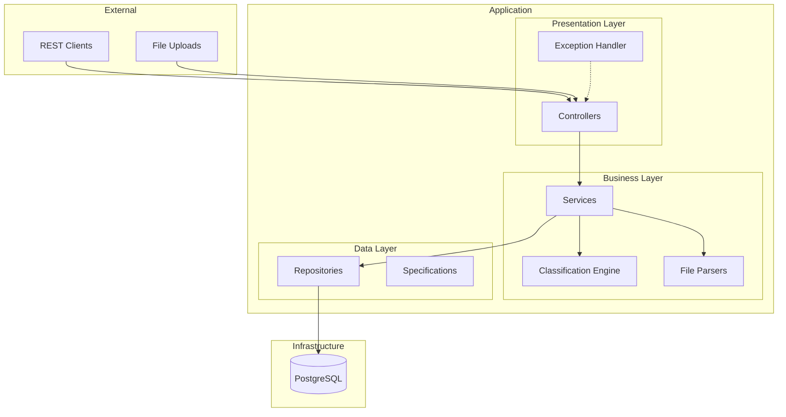
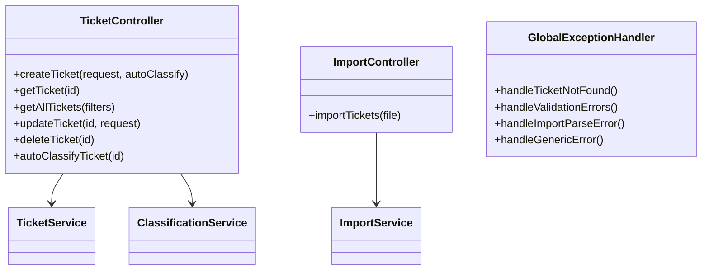
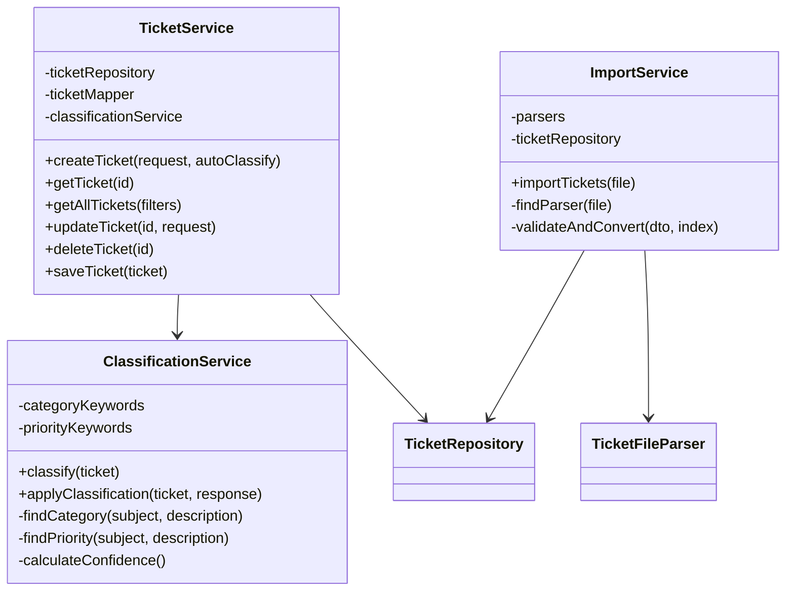
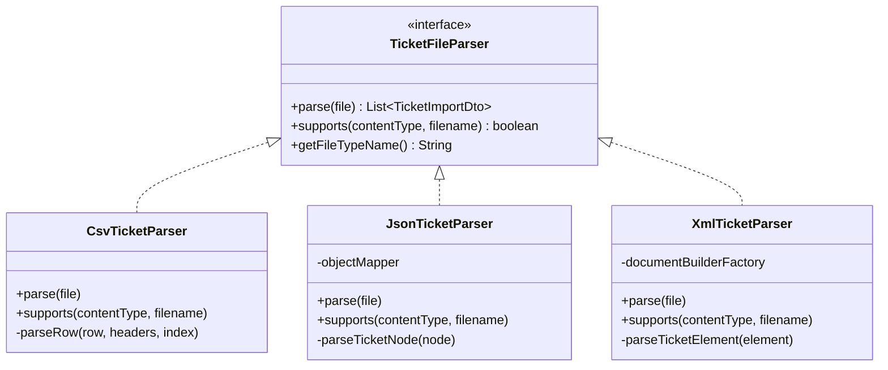
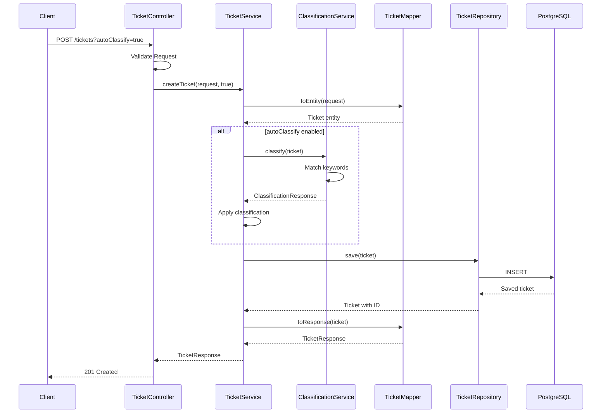
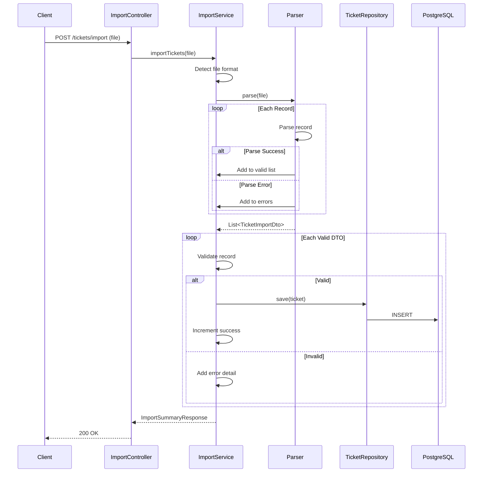
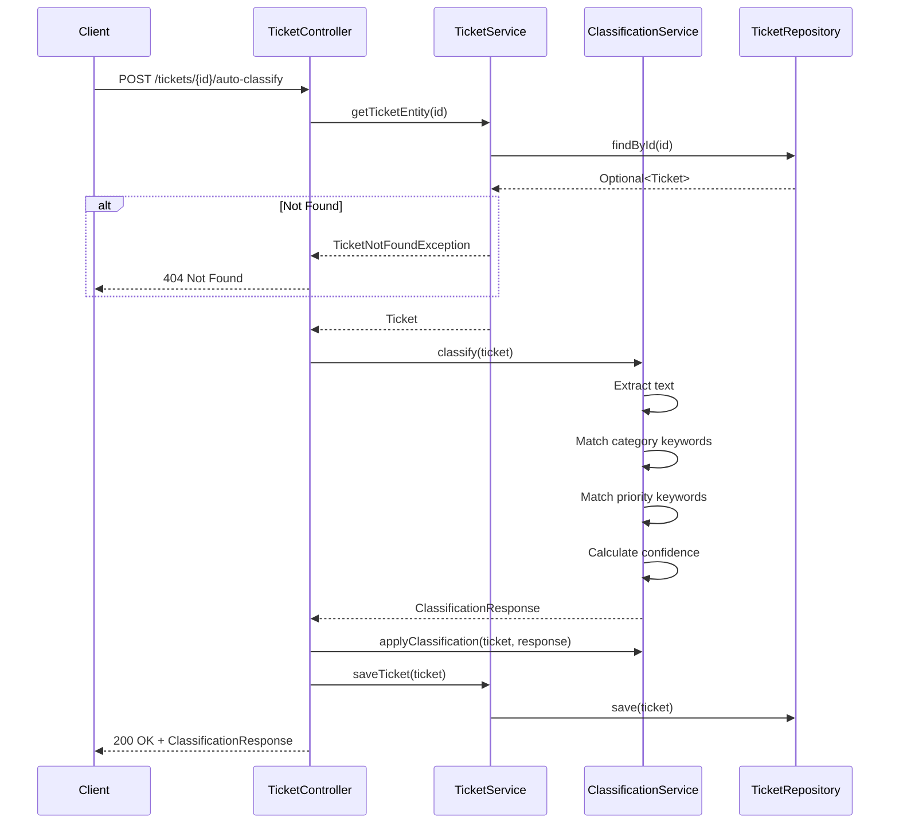
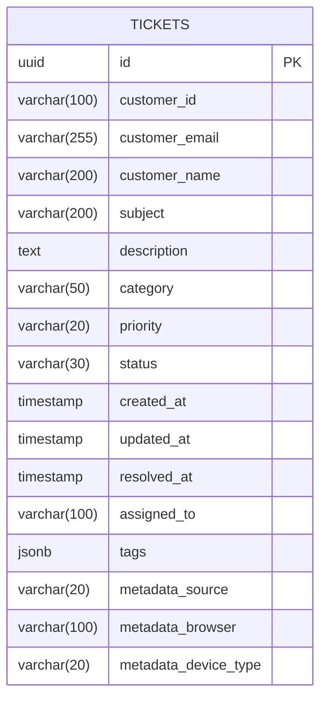

# Architecture Documentation

Technical architecture documentation for the Intelligent Customer Support System.

## Table of Contents

1. [High-Level Architecture](#high-level-architecture)
2. [Component Architecture](#component-architecture)
3. [Data Flow Diagrams](#data-flow-diagrams)
4. [Database Design](#database-design)
5. [Design Decisions](#design-decisions)
6. [Security Considerations](#security-considerations)
7. [Performance Considerations](#performance-considerations)

---

## High-Level Architecture

The system follows a layered architecture pattern with clear separation of concerns.



### Layer Responsibilities

| Layer | Responsibility |
|-------|----------------|
| **Presentation** | REST endpoints, request validation, response formatting |
| **Business** | Business logic, orchestration, classification |
| **Data** | Data persistence, queries, transactions |
| **Infrastructure** | Database, external services |

---

## Component Architecture

### Controllers



### Services



### Parsers (Strategy Pattern)



---

## Data Flow Diagrams

### Create Ticket Flow



### Bulk Import Flow



### Classification Flow



---

## Database Design

### Entity Relationship Diagram



### Indexes

| Index Name | Columns | Purpose |
|------------|---------|---------|
| `idx_tickets_status` | status | Filter by status |
| `idx_tickets_category` | category | Filter by category |
| `idx_tickets_priority` | priority | Filter by priority |
| `idx_tickets_customer_id` | customer_id | Filter by customer |
| `idx_tickets_created_at` | created_at DESC | Sort by creation date |
| `idx_tickets_status_category` | status, category | Combined filtering |
| `idx_tickets_status_priority` | status, priority | Combined filtering |

---

## Design Decisions

### Decision 1: Spring Boot 3.x

| Aspect | Details |
|--------|---------|
| **Decision** | Use Spring Boot 3.2.x |
| **Alternatives** | Spring Boot 2.x, Quarkus, Micronaut |
| **Rationale** | Latest LTS, Jakarta EE 10, best community support, native Spring features |
| **Consequences** | Requires Java 17+, some library compatibility considerations |

### Decision 2: PostgreSQL with JSONB

| Aspect | Details |
|--------|---------|
| **Decision** | Store tags as JSONB column |
| **Alternatives** | Separate tags table, comma-separated string |
| **Rationale** | Query flexibility, no join overhead, PostgreSQL-optimized indexing |
| **Consequences** | PostgreSQL-specific, requires JSON handling in code |

### Decision 3: Strategy Pattern for Parsers

| Aspect | Details |
|--------|---------|
| **Decision** | Use Strategy pattern for file parsers |
| **Alternatives** | Single class with switch statement |
| **Rationale** | Open/Closed principle, easy to add new formats |
| **Consequences** | More classes, but better maintainability |

### Decision 4: Java Records for DTOs

| Aspect | Details |
|--------|---------|
| **Decision** | Use Java records for request/response DTOs |
| **Alternatives** | Traditional POJOs, Lombok @Data |
| **Rationale** | Immutability, less boilerplate, built-in equals/hashCode |
| **Consequences** | Requires Java 17+, some frameworks may need adapters |

### Decision 5: Keyword-Based Classification

| Aspect | Details |
|--------|---------|
| **Decision** | Use configurable keyword matching for classification |
| **Alternatives** | Machine learning, external NLP service |
| **Rationale** | Simple, fast, no external dependencies, easy to customize |
| **Consequences** | Limited accuracy compared to ML, requires keyword maintenance |

---

## Security Considerations

### Input Validation

| Concern | Mitigation |
|---------|------------|
| SQL Injection | JPA parameterized queries (Hibernate) |
| XSS | JSON responses only, no HTML rendering |
| Mass Assignment | Explicit DTO-to-Entity mapping |
| Invalid Input | Bean Validation on all DTOs |

### File Upload Security

| Concern | Mitigation |
|---------|------------|
| Large Files | Max file size limit (10MB) |
| Malicious Content | Content type validation |
| XXE Attacks | XML parser configured to block external entities |
| Path Traversal | No file path exposure, in-memory processing |

### Error Handling

| Concern | Mitigation |
|---------|------------|
| Information Leakage | Generic error messages in production |
| Stack Traces | Logged but not exposed to clients |
| Sensitive Data | No sensitive data in error responses |

---

## Performance Considerations

### Database Optimization

| Technique | Implementation |
|-----------|----------------|
| Indexing | Indexes on frequently filtered columns |
| Connection Pooling | HikariCP with optimized pool size |
| Query Optimization | JPA Specifications for dynamic queries |

### Application Optimization

| Technique | Implementation |
|-----------|----------------|
| Pattern Compilation | Pre-compiled regex patterns for classification |
| Batch Processing | Bulk import processes records in batches |
| Lazy Loading | JPA lazy loading for related entities |

### Performance Targets

| Operation | Target | Threshold |
|-----------|--------|-----------|
| Create ticket | < 100ms | 200ms |
| Get ticket | < 50ms | 100ms |
| List tickets | < 200ms | 500ms |
| Bulk import (50) | < 2s | 5s |
| Classification | < 50ms | 100ms |

---

## Appendix: Technology Stack

```mermaid
graph LR
    subgraph "Application"
        JAVA[Java 17]
        SPRING[Spring Boot 3.2]
        JPA[Spring Data JPA]
        VAL[Bean Validation]
    end

    subgraph "Data"
        PG[PostgreSQL 15]
        FLY[Flyway]
        HIK[HikariCP]
    end

    subgraph "Utilities"
        CSV[OpenCSV]
        JACK[Jackson]
        JAXB[JAXB]
    end

    subgraph "Testing"
        JUNIT[JUnit 5]
        MOCK[Mockito]
        JACO[JaCoCo]
    end

    subgraph "Documentation"
        OAPI[SpringDoc OpenAPI]
        SWAG[Swagger UI]
    end

    SPRING --> JPA
    JPA --> HIK
    HIK --> PG
    FLY --> PG
