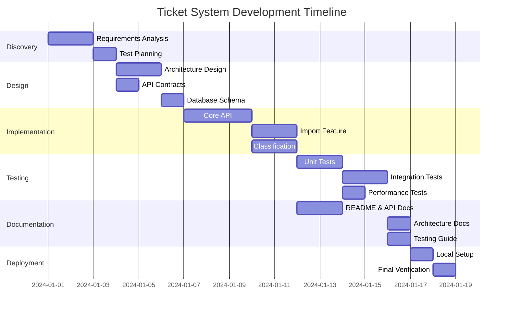

# Intelligent Customer Support System - Development Plan

## Project Assumptions

- **Tech Stack**: Java 17+ with Spring Boot 3.x framework
- **Database**: PostgreSQL 15+ for persistent storage
- **Build Tool**: Maven or Gradle for dependency management
- **Deployment**: Local development environment only (no cloud infrastructure)
- **Team Size**: Medium team (4 roles: Tech Lead/Architect, Backend Developer, QA Engineer, DevOps Engineer)
- **Authentication**: Mocked/skipped - no user management system required
- **API Type**: RESTful API only (no frontend/UI)
- **File Processing**: Support for CSV, JSON, and XML formats via standard Java libraries
- **Testing Framework**: JUnit 5 + Mockito for unit tests, Spring Boot Test for integration tests
- **Documentation**: Markdown files with Mermaid diagrams
- **AI Tools**: Development assisted by AI coding assistants (Claude, GitHub Copilot, etc.)
- **Version Control**: Git with feature branch workflow
- **Coverage Target**: >85% code coverage measured by JaCoCo
- **Concurrent Users**: Support for 20+ simultaneous requests (local testing)

---

## Stages Overview Table

| Stage | Goals | Roles | Deliverables |
|-------|-------|-------|--------------|
| **1. Discovery & Requirements** | Analyze requirements, identify technical constraints, define acceptance criteria | Tech Lead, QA Engineer | Requirements document, acceptance criteria, risk register |
| **2. Architecture & Design** | Design system architecture, define API contracts, database schema | Tech Lead, Backend Developer | Architecture diagrams, API specification, DB schema, component design |
| **3. Implementation - Core API** | Build ticket CRUD operations, validation, error handling | Backend Developer | Ticket entity, repository, service, controller, validators |
| **4. Implementation - Import** | Multi-format file parsing (CSV, JSON, XML), bulk import | Backend Developer | Import service, format parsers, bulk operation handling |
| **5. Implementation - Classification** | Auto-categorization and priority assignment logic | Backend Developer | Classification service, keyword rules engine, confidence scoring |
| **6. Testing** | Comprehensive test suite with >85% coverage | QA Engineer, Backend Developer | Unit tests, integration tests, performance tests, fixtures |
| **7. Documentation** | Multi-level documentation for all audiences | Tech Lead, Backend Developer | README, API_REFERENCE, ARCHITECTURE, TESTING_GUIDE |
| **8. Integration & Local Deployment** | End-to-end verification, local environment setup | DevOps Engineer, QA Engineer | Docker Compose setup, run scripts, final verification report |

---

## Stage Details

### Stage 1: Discovery & Requirements Analysis

**Objectives**
- Thoroughly understand all functional requirements from TASKS.md
- Identify edge cases and validation rules
- Define clear acceptance criteria for each feature
- Assess technical risks and dependencies

**Key Activities**
- Review and decompose each task into user stories
- Define validation rules for ticket model fields
- Document all enum values and their meanings
- Create sample test scenarios for each endpoint
- Identify third-party libraries needed

**Dependencies**
- Access to TASKS.md requirements document
- Stakeholder availability for clarifications

**Risks/Mitigations**
| Risk | Likelihood | Impact | Mitigation |
|------|------------|--------|------------|
| Ambiguous requirements | Medium | High | Document assumptions, get early sign-off |
| Scope creep | Medium | Medium | Strict adherence to TASKS.md, defer enhancements |
| Missing edge cases | High | Medium | Thorough test scenario planning upfront |

**Exit Criteria**
- [ ] All requirements mapped to user stories
- [ ] Acceptance criteria defined for each endpoint
- [ ] Validation rules documented
- [ ] Risk register created
- [ ] Sample data requirements specified

---

### Stage 2: Architecture & Design

**Objectives**
- Design layered application architecture
- Define database schema with proper constraints
- Specify REST API contracts with request/response formats
- Plan for testability and maintainability

**Key Activities**
- Create high-level architecture diagram
- Design database schema with indexes
- Define API endpoints with OpenAPI/Swagger spec
- Plan package structure and component responsibilities
- Select libraries for file parsing (Jackson, OpenCSV, JAXB)

**Dependencies**
- Completed requirements analysis (Stage 1)
- Tech stack decisions finalized

**Risks/Mitigations**
| Risk | Likelihood | Impact | Mitigation |
|------|------------|--------|------------|
| Over-engineering | Medium | Medium | Keep design simple, YAGNI principle |
| Poor separation of concerns | Low | High | Follow standard Spring Boot patterns |
| Schema migration issues | Low | Medium | Use Flyway/Liquibase from start |

**Exit Criteria**
- [ ] Architecture diagram approved
- [ ] Database schema defined with all constraints
- [ ] API contracts documented
- [ ] Package structure defined
- [ ] Library dependencies identified

---

### Stage 3: Implementation - Core API

**Objectives**
- Implement ticket CRUD operations
- Build robust validation layer
- Implement proper error handling with meaningful messages
- Ensure correct HTTP status codes

**Key Activities**
- Create Ticket entity with JPA annotations
- Implement TicketRepository with custom queries
- Build TicketService with business logic
- Create TicketController with REST endpoints
- Implement validation using Bean Validation (JSR-380)
- Build global exception handler

**Dependencies**
- Database schema (Stage 2)
- API contracts (Stage 2)
- Spring Boot project initialized

**Risks/Mitigations**
| Risk | Likelihood | Impact | Mitigation |
|------|------------|--------|------------|
| Validation gaps | Medium | Medium | Use validation groups, test all edge cases |
| Performance issues with queries | Low | Medium | Add indexes, use pagination |
| Inconsistent error responses | Medium | Low | Centralized exception handling |

**Exit Criteria**
- [ ] All CRUD endpoints functional
- [ ] Validation working for all fields
- [ ] Proper HTTP status codes returned
- [ ] Error responses follow consistent format
- [ ] Basic happy path tests passing

---

### Stage 4: Implementation - Import

**Objectives**
- Parse CSV, JSON, and XML file formats
- Handle bulk imports with transaction management
- Provide detailed import summaries
- Gracefully handle malformed files

**Key Activities**
- Implement CSV parser using OpenCSV
- Implement JSON parser using Jackson
- Implement XML parser using JAXB
- Create ImportService for bulk operations
- Build import summary response structure
- Handle partial failures with detailed error reporting

**Dependencies**
- Core ticket API (Stage 3)
- Ticket validation logic (Stage 3)

**Risks/Mitigations**
| Risk | Likelihood | Impact | Mitigation |
|------|------------|--------|------------|
| Memory issues with large files | Medium | High | Stream processing, file size limits |
| Inconsistent parsing across formats | Medium | Medium | Unified DTO mapping layer |
| Transaction rollback on partial failure | Medium | Medium | Batch processing with individual error capture |

**Exit Criteria**
- [ ] CSV import working with all fields
- [ ] JSON import working with all fields
- [ ] XML import working with all fields
- [ ] Import summary returns accurate counts
- [ ] Malformed files return helpful error messages

---

### Stage 5: Implementation - Classification

**Objectives**
- Implement keyword-based categorization
- Implement priority assignment rules
- Calculate and store confidence scores
- Log classification decisions

**Key Activities**
- Define keyword mappings for each category
- Implement priority rule engine
- Build confidence score calculation
- Create classification response with reasoning
- Add auto-classify flag to ticket creation
- Implement manual override capability

**Dependencies**
- Core ticket API (Stage 3)
- Ticket update functionality (Stage 3)

**Risks/Mitigations**
| Risk | Likelihood | Impact | Mitigation |
|------|------------|--------|------------|
| Low classification accuracy | Medium | Medium | Comprehensive keyword lists, confidence thresholds |
| Conflicting category matches | Medium | Low | Priority-based resolution, return all matches |
| Performance with large text | Low | Low | Limit text processing length |

**Exit Criteria**
- [ ] All 6 categories correctly identified
- [ ] All 4 priority levels correctly assigned
- [ ] Confidence scores calculated (0-1 range)
- [ ] Classification reasoning included in response
- [ ] Auto-classify on creation working
- [ ] Manual override preserves user choice

---

### Stage 6: Testing

**Objectives**
- Achieve >85% code coverage
- Cover all endpoints with API tests
- Test all file formats thoroughly
- Verify classification accuracy
- Validate performance under load

**Key Activities**
- Write unit tests for all services
- Write integration tests for API endpoints
- Create test fixtures for all file formats
- Implement performance benchmarks
- Generate coverage reports with JaCoCo
- Create invalid data files for negative tests

**Dependencies**
- All implementation stages complete (3, 4, 5)
- Test fixtures created

**Risks/Mitigations**
| Risk | Likelihood | Impact | Mitigation |
|------|------------|--------|------------|
| Coverage below 85% | Medium | High | Test-driven development, coverage monitoring |
| Flaky integration tests | Medium | Medium | Proper test isolation, database cleanup |
| Missing edge cases | Medium | Medium | Boundary value analysis, equivalence partitioning |

**Exit Criteria**
- [ ] >85% code coverage achieved
- [ ] All 56+ tests specified in TASKS.md passing
- [ ] Test fixtures created (CSV 50, JSON 20, XML 30 tickets)
- [ ] Invalid data files created
- [ ] Performance tests verify 20+ concurrent requests
- [ ] Coverage screenshot captured

---

### Stage 7: Documentation

**Objectives**
- Create developer-focused README
- Document API for consumers
- Provide architecture overview for tech leads
- Create testing guide for QA

**Key Activities**
- Write README.md with setup instructions
- Create API_REFERENCE.md with curl examples
- Design architecture diagrams in Mermaid
- Document data flows with sequence diagrams
- Write TESTING_GUIDE.md with manual checklist

**Dependencies**
- All implementation complete
- Tests passing
- API behavior finalized

**Risks/Mitigations**
| Risk | Likelihood | Impact | Mitigation |
|------|------------|--------|------------|
| Documentation out of sync | Medium | Medium | Generate from code where possible |
| Missing examples | Low | Medium | Test all curl commands |
| Diagrams too complex | Low | Low | Focus on key flows only |

**Exit Criteria**
- [ ] README.md complete with architecture diagram
- [ ] API_REFERENCE.md with all endpoints documented
- [ ] ARCHITECTURE.md with 2+ Mermaid diagrams
- [ ] TESTING_GUIDE.md with test pyramid diagram
- [ ] At least 3 Mermaid diagrams total
- [ ] All curl examples tested

---

### Stage 8: Integration & Local Deployment

**Objectives**
- Verify end-to-end functionality
- Provide simple local deployment
- Final quality verification

**Key Activities**
- Create Docker Compose for PostgreSQL
- Write application startup scripts
- Execute full integration test suite
- Verify bulk import with auto-classification
- Document local setup steps
- Final code review and cleanup

**Dependencies**
- All previous stages complete
- Documentation finalized

**Risks/Mitigations**
| Risk | Likelihood | Impact | Mitigation |
|------|------------|--------|------------|
| Environment-specific issues | Low | Medium | Docker for consistency |
| Missing dependencies | Low | Low | Complete pom.xml/build.gradle |
| Data persistence issues | Low | Medium | Verify database initialization |

**Exit Criteria**
- [ ] Application starts successfully
- [ ] All endpoints accessible
- [ ] Full ticket lifecycle works end-to-end
- [ ] Bulk import with classification verified
- [ ] Local setup documented and tested

---

## Role-Specific RTF Prompts

### Stage 1: Discovery & Requirements Analysis

#### Tech Lead Prompt

```
Role: You are a senior technical lead responsible for requirements analysis and project planning for a Java/Spring Boot application.

Task: Analyze the customer support ticket system requirements and produce a comprehensive requirements breakdown:

1. Decompose each feature into discrete user stories with acceptance criteria
2. Document all validation rules for the ticket model:
   - Email format validation
   - String length constraints (subject: 1-200, description: 10-2000)
   - Enum validations (category, priority, status, source, device_type)
   - Required vs optional fields
3. Identify edge cases for:
   - Bulk import with mixed valid/invalid records
   - Classification with ambiguous keywords
   - Concurrent ticket operations
4. List all HTTP status codes needed and when to use them
5. Define the sample data requirements (50 CSV, 20 JSON, 30 XML tickets)

Format: Produce a markdown document with:
- User stories table (ID | Story | Acceptance Criteria | Priority)
- Validation rules matrix (Field | Type | Constraints | Error Message)
- Edge cases catalog grouped by feature
- HTTP status code reference table
- Sample data specification
```

#### QA Engineer Prompt

```
Role: You are a QA engineer responsible for test planning and acceptance criteria definition for a REST API system.

Task: Create a comprehensive test plan for the customer support ticket system:

1. Define test scenarios for each endpoint:
   - POST /tickets (create)
   - POST /tickets/import (bulk import CSV/JSON/XML)
   - GET /tickets (list with filtering)
   - GET /tickets/:id (single ticket)
   - PUT /tickets/:id (update)
   - DELETE /tickets/:id (delete)
   - POST /tickets/:id/auto-classify (classification)

2. For each scenario, specify:
   - Preconditions
   - Test data requirements
   - Expected results
   - Edge cases to cover

3. Create a test data matrix showing what sample records are needed

4. Define performance test scenarios for 20+ concurrent requests

Format: Produce a markdown document with:
- Test scenario table per endpoint (ID | Scenario | Input | Expected Output | Priority)
- Test data requirements matrix
- Negative test cases catalog (invalid inputs, malformed files)
- Performance test specifications
- Manual testing checklist template
```

---

### Stage 2: Architecture & Design

#### Tech Lead Prompt

```
Role: You are a software architect designing a Java/Spring Boot REST API application with PostgreSQL database.

Task: Design the complete system architecture for the customer support ticket system:

1. Create a layered architecture design:
   - Controller layer (REST endpoints)
   - Service layer (business logic)
   - Repository layer (data access)
   - Domain layer (entities, DTOs)

2. Design the database schema:
   - tickets table with all columns from the model
   - Proper data types (UUID, VARCHAR, TEXT, TIMESTAMP, ENUM/VARCHAR)
   - Indexes for common queries (status, category, priority, customer_id)
   - Constraints (NOT NULL, CHECK, UNIQUE where applicable)

3. Define the package structure:
   ```
   com.support.ticketsystem/
   ├── controller/
   ├── service/
   ├── repository/
   ├── domain/
   │   ├── entity/
   │   ├── dto/
   │   └── enums/
   ├── exception/
   ├── config/
   └── util/
   ```

4. Select and justify library choices:
   - OpenCSV for CSV parsing
   - Jackson for JSON (included in Spring)
   - JAXB for XML parsing
   - JaCoCo for coverage

5. Design the API contracts with request/response DTOs

Format: Produce:
- Architecture diagram in Mermaid syntax (component diagram)
- Database schema DDL statements
- Package structure with class responsibilities
- API contract specifications (OpenAPI-style)
- Library dependency list with versions
```

#### Backend Developer Prompt

```
Role: You are a senior Java developer setting up a Spring Boot project foundation.

Task: Design the detailed component specifications for the ticket system:

1. Define all entity classes with JPA annotations:
   - Ticket entity with all fields
   - Proper column mappings
   - Enum handling strategy (@Enumerated)
   - Timestamp auto-generation

2. Design DTO classes:
   - TicketCreateRequest (for POST /tickets)
   - TicketUpdateRequest (for PUT /tickets/:id)
   - TicketResponse (for GET responses)
   - ImportRequest/ImportResponse
   - ClassificationResponse

3. Design validation annotations for each DTO field

4. Define repository interface with custom query methods:
   - findByStatus
   - findByCategory
   - findByPriority
   - Combined filters with Specification or @Query

5. Design exception hierarchy:
   - TicketNotFoundException
   - InvalidImportFileException
   - ValidationException

Format: Produce:
- Entity class design with all annotations listed
- DTO class specifications with validation rules
- Repository method signatures
- Exception class hierarchy
- Sample code snippets for complex mappings
```

---

### Stage 3: Implementation - Core API

#### Backend Developer Prompt

```
Role: You are a Java/Spring Boot developer implementing REST API endpoints.

Task: Implement the core ticket CRUD API for a customer support system using Spring Boot 3.x and PostgreSQL:

1. Create the Ticket entity class:
   - UUID id with @GeneratedValue
   - All fields from the model with proper JPA annotations
   - @CreationTimestamp and @UpdateTimestamp for timestamps
   - Proper enum mappings for category, priority, status, source, device_type

2. Create TicketRepository extending JpaRepository:
   - Custom query methods for filtering
   - Support filtering by multiple criteria (category, priority, status)

3. Create TicketService with:
   - createTicket(TicketCreateRequest) - validate and save
   - getTicket(UUID) - find or throw TicketNotFoundException
   - getAllTickets(filters) - list with optional filtering
   - updateTicket(UUID, TicketUpdateRequest) - partial updates
   - deleteTicket(UUID) - soft or hard delete

4. Create TicketController with:
   - POST /tickets - return 201 Created
   - GET /tickets - return 200 with list
   - GET /tickets/{id} - return 200 or 404
   - PUT /tickets/{id} - return 200 or 404
   - DELETE /tickets/{id} - return 204 or 404

5. Implement GlobalExceptionHandler:
   - Handle TicketNotFoundException -> 404
   - Handle MethodArgumentNotValidException -> 400
   - Handle generic exceptions -> 500
   - Consistent error response format

Format: Produce complete, compilable Java code with:
- Full import statements
- All annotations
- Javadoc comments for public methods
- Proper logging using SLF4J
- Bean Validation annotations on DTOs
```

---

### Stage 4: Implementation - Import

#### Backend Developer Prompt

```
Role: You are a Java developer implementing multi-format file import functionality.

Task: Implement bulk ticket import supporting CSV, JSON, and XML formats:

1. Create file parser interfaces and implementations:
   ```java
   public interface TicketFileParser {
       List<TicketImportDto> parse(MultipartFile file) throws ImportParseException;
       boolean supports(String contentType);
   }
   ```
   - CsvTicketParser using OpenCSV
   - JsonTicketParser using Jackson ObjectMapper
   - XmlTicketParser using JAXB

2. Create ImportService:
   - Detect file format from content type or extension
   - Parse file to list of DTOs
   - Validate each record individually
   - Save valid records, collect errors for invalid
   - Return ImportSummary with:
     - totalRecords: int
     - successfulImports: int
     - failedImports: int
     - errors: List<ImportError> (line/index, field, message)

3. Handle edge cases:
   - Empty files
   - Files with only headers (CSV)
   - Missing required fields
   - Invalid enum values
   - Malformed file structure
   - Large files (consider streaming for CSV)

4. Create import endpoint:
   - POST /tickets/import
   - Accept multipart/form-data
   - Return 200 with ImportSummary (even if some records failed)
   - Return 400 only if file itself is unreadable

5. CSV format expectations:
   - Header row with field names
   - Comma-separated values
   - Quoted strings for values containing commas

Format: Produce complete Java code with:
- Parser implementations for all three formats
- ImportService with batch processing logic
- DTOs for import request/response
- Custom exceptions for parse errors
- Unit test examples for each parser
```

---

### Stage 5: Implementation - Classification

#### Backend Developer Prompt

```
Role: You are a Java developer implementing an automatic text classification system.

Task: Implement ticket auto-classification for category and priority assignment:

1. Create ClassificationService with:
   ```java
   public ClassificationResult classify(Ticket ticket);
   ```

2. Implement category classification:
   - account_access: keywords ["login", "password", "2fa", "two-factor", "authentication", "access denied", "locked out", "reset password", "can't sign in"]
   - technical_issue: keywords ["error", "crash", "bug", "not working", "broken", "exception", "failed", "issue", "problem"]
   - billing_question: keywords ["invoice", "payment", "charge", "refund", "subscription", "billing", "price", "cost", "receipt"]
   - feature_request: keywords ["suggest", "feature", "enhancement", "would be nice", "could you add", "request", "improvement"]
   - bug_report: keywords ["reproduce", "steps to reproduce", "expected", "actual", "defect", "regression"]
   - other: default when no matches or low confidence

3. Implement priority classification:
   - urgent: keywords ["can't access", "critical", "production down", "security", "urgent", "emergency", "immediately", "asap"]
   - high: keywords ["important", "blocking", "blocker", "high priority", "need soon"]
   - low: keywords ["minor", "cosmetic", "suggestion", "when you get a chance", "low priority", "nice to have"]
   - medium: default

4. Implement confidence scoring:
   - Count keyword matches
   - Weight by keyword specificity
   - Return score 0.0 to 1.0
   - Include keywords found in response

5. Create ClassificationResult:
   - category: CategoryEnum
   - priority: PriorityEnum
   - confidence: double
   - reasoning: String (explanation)
   - keywordsFound: List<String>

6. Create classification endpoint:
   - POST /tickets/{id}/auto-classify
   - Updates ticket with classification
   - Returns ClassificationResult

7. Add auto-classify option to ticket creation:
   - Optional query param: POST /tickets?autoClassify=true
   - If true, classify after creation

Format: Produce complete Java code with:
- ClassificationService with keyword matching logic
- Configurable keyword mappings (consider @ConfigurationProperties)
- ClassificationResult DTO
- Controller endpoint
- Logging of all classification decisions
- Unit tests for each category and priority
```

---

### Stage 6: Testing

#### QA Engineer Prompt

```
Role: You are a QA engineer creating comprehensive test suites for a Java/Spring Boot REST API.

Task: Generate a complete test suite achieving >85% code coverage for the ticket system:

1. Create test structure:
   ```
   src/test/java/com/support/ticketsystem/
   ├── controller/
   │   └── TicketControllerTest.java (11 tests)
   ├── service/
   │   ├── TicketServiceTest.java (9 tests)
   │   └── ClassificationServiceTest.java (10 tests)
   ├── parser/
   │   ├── CsvTicketParserTest.java (6 tests)
   │   ├── JsonTicketParserTest.java (5 tests)
   │   └── XmlTicketParserTest.java (5 tests)
   ├── integration/
   │   └── TicketIntegrationTest.java (5 tests)
   └── performance/
       └── TicketPerformanceTest.java (5 tests)

   src/test/resources/fixtures/
   ├── valid_tickets.csv
   ├── valid_tickets.json
   ├── valid_tickets.xml
   ├── invalid_tickets.csv
   ├── malformed.csv
   └── empty.csv
   ```

2. API endpoint tests (TicketControllerTest):
   - testCreateTicket_Success
   - testCreateTicket_ValidationError
   - testGetTicket_Found
   - testGetTicket_NotFound
   - testListTickets_NoFilter
   - testListTickets_WithCategoryFilter
   - testListTickets_WithMultipleFilters
   - testUpdateTicket_Success
   - testUpdateTicket_NotFound
   - testDeleteTicket_Success
   - testDeleteTicket_NotFound

3. Classification tests (ClassificationServiceTest):
   - testClassify_AccountAccess
   - testClassify_TechnicalIssue
   - testClassify_BillingQuestion
   - testClassify_FeatureRequest
   - testClassify_BugReport
   - testClassify_Other_NoMatch
   - testClassify_UrgentPriority
   - testClassify_HighPriority
   - testClassify_LowPriority
   - testClassify_MediumPriority_Default

4. Integration tests:
   - testCompleteTicketLifecycle
   - testBulkImportWithAutoClassification
   - testConcurrentTicketCreation (20 threads)
   - testFilterByCategoryAndPriority
   - testImportPartialFailure

5. Performance tests:
   - testCreateTicket_ResponseTime
   - testBulkImport_50Records
   - testConcurrent_20Requests
   - testClassification_LargeText
   - testListTickets_Pagination

Format: Produce complete JUnit 5 test code with:
- @SpringBootTest for integration tests
- @WebMvcTest for controller tests
- MockMvc for REST testing
- @MockBean for service mocking
- Assertions using AssertJ
- @DisplayName for readable test names
- Test fixtures as resource files
```

#### Backend Developer Prompt

```
Role: You are a Java developer creating test fixtures and sample data files.

Task: Create comprehensive test data files for the ticket import testing:

1. Create sample_tickets.csv (50 tickets):
   - Include all categories (at least 8 each)
   - Include all priorities
   - Include all statuses
   - Vary metadata (source, device_type)
   - Include tickets with and without optional fields
   - Include edge cases (max length strings, special characters)

2. Create sample_tickets.json (20 tickets):
   - Valid JSON array format
   - Include nested metadata object
   - Include tickets with tags arrays
   - Mix of complete and minimal tickets

3. Create sample_tickets.xml (30 tickets):
   - Valid XML with proper root element
   - Include all field types
   - Proper date formatting

4. Create invalid test files:
   - invalid_tickets.csv: missing required fields, invalid emails, wrong enum values
   - malformed.csv: broken structure, unclosed quotes
   - invalid_tickets.json: invalid JSON, wrong types
   - invalid_tickets.xml: malformed XML

5. Create edge case files:
   - empty.csv: only headers, no data
   - single_record.json: array with one ticket
   - unicode_content.csv: tickets with unicode characters

Format: Produce actual file contents for:
- All CSV files with headers
- All JSON files properly formatted
- All XML files with schema-valid structure
- Document what each invalid file tests
```

---

### Stage 7: Documentation

#### Tech Lead Prompt

```
Role: You are a technical writer creating architecture documentation for a Java/Spring Boot application.

Task: Create ARCHITECTURE.md documentation for technical leads:

1. High-level architecture diagram (Mermaid):
   - Show all layers (Controller, Service, Repository, Database)
   - Show external file inputs (CSV, JSON, XML)
   - Show request/response flow

2. Component descriptions:
   - Purpose of each layer
   - Key classes and their responsibilities
   - Dependency injection patterns used

3. Data flow diagrams (Mermaid sequence diagrams):
   - Ticket creation flow
   - Bulk import flow
   - Auto-classification flow

4. Design decisions:
   - Why Spring Boot?
   - Why PostgreSQL?
   - Parser strategy pattern for file formats
   - Exception handling approach
   - Validation strategy

5. Security considerations:
   - Input validation
   - SQL injection prevention (JPA/Hibernate)
   - File upload restrictions

6. Performance considerations:
   - Database indexing strategy
   - Bulk import batch processing
   - Connection pooling

Format: Produce complete ARCHITECTURE.md with:
- At least 2 Mermaid diagrams (component + sequence)
- Clear section headers
- Decision tables (Option | Pros | Cons | Decision)
- Code snippets where helpful
```

#### Backend Developer Prompt

```
Role: You are a technical writer creating API documentation for developers consuming a REST API.

Task: Create API_REFERENCE.md documentation for API consumers:

1. Document all endpoints with:
   - HTTP method and path
   - Description
   - Request parameters (path, query, body)
   - Request body schema with all fields
   - Response schema
   - HTTP status codes
   - Example request (curl)
   - Example response (JSON)

2. Endpoints to document:
   - POST /tickets
   - POST /tickets/import
   - GET /tickets
   - GET /tickets/{id}
   - PUT /tickets/{id}
   - DELETE /tickets/{id}
   - POST /tickets/{id}/auto-classify

3. Data models section:
   - Ticket model with all fields
   - Enum values for category, priority, status, source, device_type
   - Validation rules

4. Error responses:
   - Standard error format
   - Common error codes
   - Troubleshooting tips

5. Query parameters for filtering:
   - category (enum)
   - priority (enum)
   - status (enum)
   - customer_id (string)

Format: Produce complete API_REFERENCE.md with:
- Table of contents
- Endpoint sections with consistent format
- Working curl examples (use localhost:8080)
- JSON request/response examples
- Error response examples
```

#### QA Engineer Prompt

```
Role: You are a QA engineer creating testing documentation.

Task: Create TESTING_GUIDE.md for QA engineers:

1. Test pyramid diagram (Mermaid):
   - Unit tests (base)
   - Integration tests (middle)
   - E2E tests (top)
   - Show approximate counts for each level

2. How to run tests:
   - Run all tests: mvn test
   - Run specific test class
   - Run with coverage: mvn test jacoco:report
   - View coverage report location

3. Test structure explanation:
   - Directory layout
   - Naming conventions
   - What each test file covers

4. Test fixtures:
   - Location: src/test/resources/fixtures/
   - Description of each file
   - How to add new test data

5. Manual testing checklist:
   - Pre-requisites
   - Setup steps
   - Test cases with steps
   - Expected results

6. Performance benchmarks table:
   - Operation | Expected Time | Threshold
   - Create ticket | < 100ms | 200ms
   - Bulk import 50 | < 2s | 5s
   - Classification | < 50ms | 100ms

Format: Produce complete TESTING_GUIDE.md with:
- Test pyramid Mermaid diagram
- Command examples in code blocks
- Manual testing checklist with checkboxes
- Performance benchmarks table
- Troubleshooting section for common test failures
```

---

### Stage 8: Integration & Local Deployment

#### DevOps Engineer Prompt

```
Role: You are a DevOps engineer setting up local development environment.

Task: Create local deployment configuration for the ticket system:

1. Create docker-compose.yml:
   - PostgreSQL 15 service
   - Volume for data persistence
   - Environment variables for credentials
   - Health check configuration
   - Port mapping (5432:5432)

2. Create application configuration:
   - application.yml with PostgreSQL connection
   - application-local.yml profile
   - Database initialization (schema creation)

3. Create setup scripts:
   - start.sh: Start database, wait for ready, run app
   - stop.sh: Stop all services
   - reset-db.sh: Drop and recreate database

4. Create .env.example:
   - Database credentials
   - Application port
   - Log level

5. Document prerequisites:
   - Java 17+
   - Maven 3.8+
   - Docker & Docker Compose
   - 4GB RAM recommended

Format: Produce:
- docker-compose.yml
- application.yml and application-local.yml
- Shell scripts (bash)
- .env.example
- Setup section for README.md
```

#### QA Engineer Prompt

```
Role: You are a QA engineer performing final verification testing.

Task: Create and execute final verification test plan:

1. Environment verification:
   - Database connectivity
   - Application startup
   - All endpoints responding

2. Smoke tests:
   - Create a ticket
   - Retrieve the ticket
   - Update the ticket
   - Delete the ticket

3. Feature verification:
   - Import 10 tickets from CSV
   - Import 5 tickets from JSON
   - Import 5 tickets from XML
   - Auto-classify 5 tickets
   - Verify classification accuracy

4. Edge case verification:
   - Import file with invalid records
   - Classify ticket with no keywords
   - Filter by multiple criteria

5. Performance verification:
   - 20 concurrent ticket creations
   - Bulk import performance

6. Create verification report template:
   - Test | Status | Notes
   - Overall pass/fail
   - Issues found
   - Sign-off

Format: Produce:
- Verification test checklist (markdown with checkboxes)
- curl commands for each verification step
- Expected results for each test
- Verification report template
```

---

## Timeline and Sequencing



### Stage Dependencies

```
Stage 1 (Discovery)
    ↓
Stage 2 (Architecture)
    ↓
Stage 3 (Core API) ──────────────────┐
    ↓                                │
Stage 4 (Import) ←───────────────────┤
    ↓                                │
Stage 5 (Classification) ←───────────┘
    ↓
Stage 6 (Testing) ← requires all implementation
    ↓
Stage 7 (Documentation) ← can start partially with Stage 6
    ↓
Stage 8 (Deployment) ← requires all previous stages
```

### Parallel Work Opportunities

| Stage | Parallel Activities |
|-------|---------------------|
| Stage 2 | Architecture + API contracts can be done together |
| Stage 4 & 5 | Import and Classification can be developed in parallel after Core API |
| Stage 6 | Unit tests can start during implementation stages |
| Stage 7 | README can start once Core API is stable; other docs after testing |

### Critical Path

1. **Discovery** → **Architecture** → **Core API** → **Testing** → **Deployment**

The Import and Classification features branch off from Core API but must merge back for Testing.

### Recommended Team Allocation

| Stage | Tech Lead | Backend Dev | QA Engineer | DevOps |
|-------|-----------|-------------|-------------|--------|
| 1. Discovery | Lead | Support | Active | - |
| 2. Architecture | Lead | Active | Review | Consult |
| 3. Core API | Review | Lead | Prepare tests | - |
| 4. Import | - | Lead | Prepare tests | - |
| 5. Classification | - | Lead | Prepare tests | - |
| 6. Testing | Review | Support | Lead | - |
| 7. Documentation | Active | Active | Active | - |
| 8. Deployment | Review | Support | Active | Lead |

---

## Appendix: Quick Reference

### Tech Stack Summary

| Component | Technology | Version |
|-----------|------------|---------|
| Language | Java | 17+ |
| Framework | Spring Boot | 3.x |
| Database | PostgreSQL | 15+ |
| Build | Maven | 3.8+ |
| Testing | JUnit 5 + Mockito | Latest |
| Coverage | JaCoCo | Latest |
| CSV Parsing | OpenCSV | 5.x |
| XML Parsing | JAXB | Included in Java |
| JSON | Jackson | Included in Spring |
| Containers | Docker | Latest |

### Key Deliverables Checklist

- [ ] Source code with all features implemented
- [ ] Test coverage >85% with JaCoCo report
- [ ] Screenshot: docs/screenshots/test_coverage.png
- [ ] Sample data: sample_tickets.csv (50), .json (20), .xml (30)
- [ ] Invalid test data files
- [ ] README.md
- [ ] API_REFERENCE.md
- [ ] ARCHITECTURE.md
- [ ] TESTING_GUIDE.md
- [ ] Docker Compose configuration
- [ ] Local setup scripts
