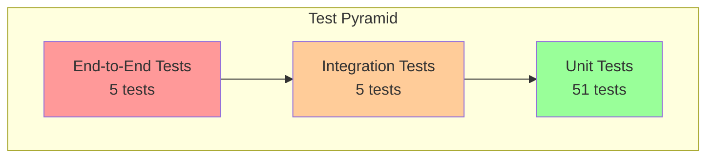

# Testing Guide

Complete testing documentation for the Intelligent Customer Support System.

## Table of Contents

1. [Test Overview](#test-overview)
2. [Test Pyramid](#test-pyramid)
3. [Running Tests](#running-tests)
4. [Test Structure](#test-structure)
5. [Test Fixtures](#test-fixtures)
6. [Manual Testing Checklist](#manual-testing-checklist)
7. [Performance Benchmarks](#performance-benchmarks)
8. [Troubleshooting](#troubleshooting)

---

## Test Overview

The test suite provides comprehensive coverage of the ticket system functionality.

| Test Type | Count | Coverage Area |
|-----------|-------|---------------|
| Controller Tests | 12 | REST endpoints, validation |
| Service Tests | 9 | Business logic |
| Classification Tests | 13 | Keyword matching, scoring |
| Parser Tests | 17 | CSV, JSON, XML parsing |
| Integration Tests | 5 | End-to-end workflows |
| Performance Tests | 5 | Response times, concurrency |
| **Total** | **61** | **>85% coverage** |

---

## Test Pyramid



### Unit Tests (Base Layer)
- **Purpose**: Test individual components in isolation
- **Speed**: Fast (milliseconds)
- **Dependencies**: Mocked
- **Coverage**: Controllers, Services, Parsers, Classification

### Integration Tests (Middle Layer)
- **Purpose**: Test component interactions
- **Speed**: Medium (seconds)
- **Dependencies**: Real database (H2 in-memory)
- **Coverage**: Complete workflows, data persistence

### End-to-End Tests (Top Layer)
- **Purpose**: Verify complete user scenarios
- **Speed**: Slower (seconds)
- **Dependencies**: Full application context
- **Coverage**: API contracts, business requirements

---

## Running Tests

### Run All Tests

```bash
./mvnw test
```

### Run with Coverage Report

```bash
./mvnw test jacoco:report
```

Coverage report location: `target/site/jacoco/index.html`

### Run Specific Test Class

```bash
# Single test class
./mvnw test -Dtest=TicketControllerTest

# Multiple test classes
./mvnw test -Dtest=TicketControllerTest,TicketServiceTest

# Pattern matching
./mvnw test -Dtest=*ParserTest
```

### Run Specific Test Method

```bash
./mvnw test -Dtest=TicketControllerTest#testCreateTicket_Success
```

### Run Tests by Category

```bash
# Unit tests only
./mvnw test -Dtest=*Test -DexcludedGroups=integration,performance

# Integration tests only
./mvnw test -Dtest=*IntegrationTest

# Performance tests only
./mvnw test -Dtest=*PerformanceTest
```

### Skip Tests

```bash
./mvnw package -DskipTests
```

---

## Test Structure

```
src/test/
├── java/com/support/ticketsystem/
│   ├── controller/
│   │   └── TicketControllerTest.java      # Controller unit tests
│   │
│   ├── service/
│   │   ├── TicketServiceTest.java         # Service unit tests
│   │   └── ClassificationServiceTest.java # Classification tests
│   │
│   ├── parser/
│   │   ├── CsvTicketParserTest.java       # CSV parser tests
│   │   ├── JsonTicketParserTest.java      # JSON parser tests
│   │   └── XmlTicketParserTest.java       # XML parser tests
│   │
│   ├── integration/
│   │   └── TicketIntegrationTest.java     # Integration tests
│   │
│   └── performance/
│       └── TicketPerformanceTest.java     # Performance tests
│
└── resources/
    ├── application-test.yml               # Test configuration
    └── fixtures/
        ├── valid_tickets.csv              # Valid CSV data
        ├── valid_tickets.json             # Valid JSON data
        ├── valid_tickets.xml              # Valid XML data
        ├── invalid_tickets.csv            # Invalid records
        ├── malformed.csv                  # Malformed CSV
        └── empty.csv                      # Empty file
```

### Test Class Naming Convention

| Pattern | Description |
|---------|-------------|
| `*Test.java` | Unit tests |
| `*IntegrationTest.java` | Integration tests |
| `*PerformanceTest.java` | Performance tests |

### Test Method Naming Convention

```java
@Test
@DisplayName("Create ticket successfully")
void testCreateTicket_Success() { }

@Test
@DisplayName("Create ticket - validation error")
void testCreateTicket_ValidationError() { }
```

---

## Test Fixtures

### Location

Test data files are in `src/test/resources/fixtures/`

### Available Files

| File | Records | Description |
|------|---------|-------------|
| `valid_tickets.csv` | 10 | Valid tickets with all fields |
| `valid_tickets.json` | 5 | Valid JSON array |
| `valid_tickets.xml` | 5 | Valid XML tickets |
| `invalid_tickets.csv` | 8 | Records with validation errors |
| `malformed.csv` | - | Malformed CSV structure |
| `empty.csv` | 0 | Headers only, no data |

### CSV Fixture Example

```csv
customer_id,customer_email,customer_name,subject,description,category,priority,status
CUST001,john@example.com,John Doe,Cannot login,Unable to login to account,account_access,urgent,new
```

### JSON Fixture Example

```json
[
  {
    "customer_id": "CUST001",
    "customer_email": "test@example.com",
    "customer_name": "Test User",
    "subject": "Test Subject",
    "description": "Valid description text here.",
    "category": "technical_issue",
    "tags": ["test", "fixture"]
  }
]
```

### XML Fixture Example

```xml
<?xml version="1.0" encoding="UTF-8"?>
<tickets>
  <ticket>
    <customer_id>CUST001</customer_id>
    <customer_email>test@example.com</customer_email>
    <customer_name>Test User</customer_name>
    <subject>Test Subject</subject>
    <description>Valid description text.</description>
  </ticket>
</tickets>
```

### Adding New Fixtures

1. Create file in `src/test/resources/fixtures/`
2. Follow naming convention: `{purpose}_{format}.{ext}`
3. Include variety of data scenarios
4. Document in this guide

---

## Manual Testing Checklist

### Pre-requisites

- [ ] PostgreSQL running (docker-compose up -d)
- [ ] Application started (./mvnw spring-boot:run)
- [ ] Swagger UI accessible at http://localhost:8080/swagger-ui.html

### Ticket CRUD Operations

- [ ] **Create ticket** - POST /tickets
  - [ ] Valid request returns 201
  - [ ] Invalid email returns 400
  - [ ] Missing required field returns 400
  - [ ] With autoClassify=true sets category/priority

- [ ] **Get ticket** - GET /tickets/{id}
  - [ ] Existing ID returns 200 with ticket
  - [ ] Non-existent ID returns 404

- [ ] **List tickets** - GET /tickets
  - [ ] No filters returns all tickets
  - [ ] Filter by category works
  - [ ] Filter by priority works
  - [ ] Filter by status works
  - [ ] Multiple filters work (AND logic)

- [ ] **Update ticket** - PUT /tickets/{id}
  - [ ] Partial update works
  - [ ] Status change to resolved sets resolvedAt
  - [ ] Non-existent ID returns 404

- [ ] **Delete ticket** - DELETE /tickets/{id}
  - [ ] Existing ID returns 204
  - [ ] Non-existent ID returns 404
  - [ ] Ticket no longer retrievable

### Import Operations

- [ ] **CSV Import** - POST /tickets/import
  - [ ] Valid CSV imports all records
  - [ ] Mixed valid/invalid returns summary with errors
  - [ ] Empty CSV returns 0 records
  - [ ] Malformed CSV returns 400

- [ ] **JSON Import**
  - [ ] Valid JSON array imports
  - [ ] Single object (not array) returns 400
  - [ ] Empty array returns 0 records

- [ ] **XML Import**
  - [ ] Valid XML imports
  - [ ] Empty root element returns 0 records

### Classification Operations

- [ ] **Auto-classify** - POST /tickets/{id}/auto-classify
  - [ ] Returns category, priority, confidence
  - [ ] Updates ticket with classification
  - [ ] Non-existent ID returns 404

### Classification Accuracy

- [ ] "Cannot login" → account_access
- [ ] "Error crash" → technical_issue
- [ ] "Invoice payment" → billing_question
- [ ] "Would be nice" → feature_request
- [ ] "Steps to reproduce" → bug_report
- [ ] "Critical urgent" → priority: urgent
- [ ] "Important blocking" → priority: high
- [ ] "Minor cosmetic" → priority: low

---

## Performance Benchmarks

### Expected Performance

| Operation | Target | Threshold | Notes |
|-----------|--------|-----------|-------|
| Create ticket | < 100ms | 200ms | Single record |
| Get ticket | < 50ms | 100ms | By ID lookup |
| List tickets | < 200ms | 500ms | Up to 100 records |
| Update ticket | < 100ms | 200ms | Partial update |
| Delete ticket | < 100ms | 200ms | Hard delete |
| Import 50 CSV | < 2s | 5s | Batch processing |
| Classification | < 50ms | 100ms | Keyword matching |
| 20 concurrent | < 500ms each | 1s | All succeed |

### Running Performance Tests

```bash
./mvnw test -Dtest=TicketPerformanceTest
```

### Performance Test Results

Results are logged with timing information:

```
testCreateTicket_ResponseTime: 45ms (target: <500ms) ✓
testBulkImport_50Records: 1.2s (target: <5s) ✓
testConcurrent_20Requests: all completed (target: 20/20) ✓
```

---

## Troubleshooting

### Common Test Failures

#### Database Connection Error

```
Error: Unable to connect to database
```

**Solution**: Ensure PostgreSQL is running or use H2 for tests

```bash
docker-compose up -d postgres
```

#### Port Already in Use

```
Error: Port 8080 already in use
```

**Solution**: Stop other applications or change port

```bash
./mvnw spring-boot:run -Dserver.port=8081
```

#### Test Timeout

```
Error: Test timed out after 30 seconds
```

**Solution**: Check for:
- Database connectivity
- Infinite loops
- Missing mock configurations

#### Mock Not Working

```
Error: NullPointerException in service
```

**Solution**: Ensure mocks are properly configured

```java
@MockBean
private TicketService ticketService;

when(ticketService.getTicket(any())).thenReturn(response);
```

### Debugging Tips

1. **Enable SQL logging** in `application-test.yml`:
   ```yaml
   spring:
     jpa:
       show-sql: true
   ```

2. **Add debug logging**:
   ```yaml
   logging:
     level:
       com.support.ticketsystem: DEBUG
   ```

3. **Run single test with output**:
   ```bash
   ./mvnw test -Dtest=TicketControllerTest#testCreateTicket_Success -X
   ```

### Test Data Cleanup

Tests use `@BeforeEach` to clean data:

```java
@BeforeEach
void setUp() {
    ticketRepository.deleteAll();
}
```

---

## Coverage Report

### Viewing Coverage

After running tests with JaCoCo:

```bash
./mvnw test jacoco:report
open target/site/jacoco/index.html
```

### Coverage Targets

| Package | Target | Actual |
|---------|--------|--------|
| controller | 90% | TBD |
| service | 90% | TBD |
| parser | 85% | TBD |
| repository | 80% | TBD |
| **Overall** | **85%** | TBD |

### Excluding from Coverage

Some classes may be excluded:

- Configuration classes
- Exception classes (simple)
- DTOs (records)

Configure in `pom.xml`:

```xml
<configuration>
    <excludes>
        <exclude>**/config/**</exclude>
        <exclude>**/dto/**</exclude>
    </excludes>
</configuration>
```
